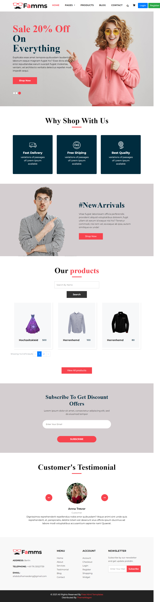
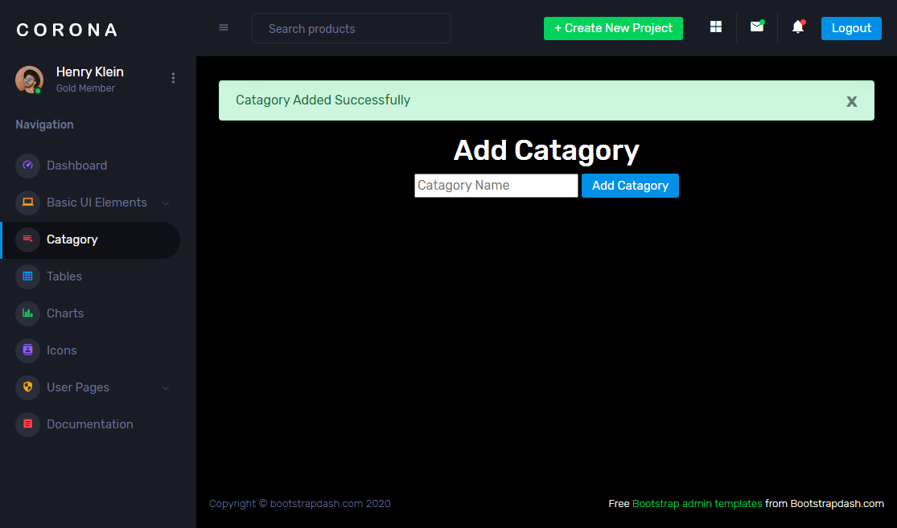

#  Laravel v.11 E-Commerce Store

##  Projektübersicht
Dieses Projekt ist eine webbasierte E-Commerce-Anwendung 

##  Projektbeschreibung
Dieses Projekt ist eine moderne **E-Commerce Webanwendung**, die mit **Laravel 11** entwickelt wird.

Das Projekt basiert auf einem vorgefertigten Online-Shop Template mit Benutzeroberfläche und Admin Dashboard.  
Die Anwendung befindet sich aktuell in der Entwicklungsphase.

---

### Startseite

## Admin Dashboard

---

##  Ziel des Projekts
Dieses Projekt dient dazu:

- Laravel Kenntnisse zu vertiefen
- Eine reale E-Commerce Anwendung zu entwickeln
- Professionelle Entwicklungsprozesse zu demonstrieren
- Ein Portfolio Projekt für Arbeitgeber zu erstellen

---

##  Technologien

- Laravel 11
- PHP 8.2
- MySQL
- Blade Template Engine
- HTML / CSS / JavaScript
- Bootstrap / Tailwind
- Git & GitHub

---

##  Funktionen

###  Benutzerbereich
- Registrierung
- Login & Authentifizierung
- Produktübersicht
- Produktdetailseiten

---

###  Admin Bereich
- Admin Login
- Produktverwaltung
- Kategorienverwaltung
- Bestellverwaltung (geplant)
- Benutzerverwaltung (geplant)

---

##  Template Integration
Das Projekt verwendet ein externes Shop Template, das in Laravel integrieren wird.

---

##  Lernprozess
Die Entwicklung erfolgt parallel zu einer YouTube Schulung zur Erstellung eines Laravel E-Commerce Systems.

---

##  Projektstatus
 Projekt in Entwicklung

Neue Funktionen werden regelmäßig hinzugefügt.

---

##  Autor
Ali Abdulhameed / Feb.2026

---