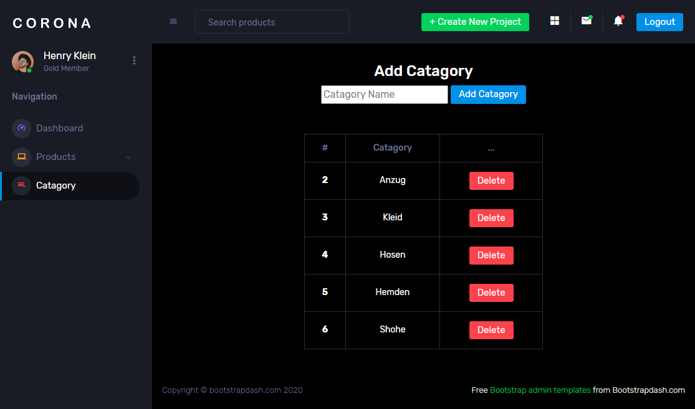

# 🛒 Laravel 11 E-Commerce Store

## 📌 Overview

This project is a modern **E-Commerce Web Application** built with Laravel 11.
It includes a complete **Admin Dashboard**, **Frontend UI**, and a fully functional **RESTful API** secured with token-based authentication.

The project is designed as a **portfolio project** to demonstrate backend development skills using Laravel.

---

## 🖼️ Screenshots

### 🏠 Home Page


### ⚙️ Admin Dashboard



### ➕ Add Product


### 📦 Products


### ✏️ Edit Product


---

## 🚀 Features

### 🔐 Authentication (API)

* User registration & login
* Token-based authentication using Laravel Sanctum
* Secure API endpoints

---

### 🛍️ Products Management

* Create, Read, Update, Delete (CRUD)
* Pagination
* Search functionality
* Category relationship
* API Resource transformation

---

### 📂 Categories Management

* CRUD operations
* Linked with products
* API support

---

### 🌐 Frontend (Blade)

* Home page
* Product listing
* Admin dashboard
* Reusable components & layouts

---

## 🧱 Project Structure

```plaintext id="fixedtree"
app/
├── Http/
│   ├── Controllers/
│   │   ├── API/
│   │   │   ├── AuthController.php
│   │   │   ├── ProductController.php
│   │   │   └── CategoryController.php
│   │   │
│   │   └── Web/
│   │       ├── ProductController.php
│   │       ├── CategoryController.php
│   │       └── HomeController.php
│   │
│   ├── Requests/
│   │   ├── StoreProductRequest.php
│   │   ├── StoreCategoryRequest.php
│   │   └── API/
│   │       └── StoreProductRequest.php
│   │
│   ├── Resources/
│   │   ├── ProductResource.php
│   │   └── CategoryResource.php
│   │
│   └── Middleware/
│
├── Models/
│   ├── Product.php
│   ├── Category.php
│   └── User.php
│
routes/
├── web.php
└── api.php
│
resources/
└── views/
    ├── layouts/
    ├── admin/
    ├── frontend/
    └── components/
```

---

## ⚙️ Technologies

* PHP 8.2
* Laravel 11
* MySQL
* Blade Template Engine
* Bootstrap / Tailwind
* REST API (Sanctum)
* Git & GitHub

---

## 🔌 API Endpoints (Examples)

```http id="endpoints"
POST   /api/login
POST   /api/register

GET    /api/products
POST   /api/products
PUT    /api/products/{id}
DELETE /api/products/{id}

GET    /api/categories
```

---

## 🎯 Project Goals

* Practice Laravel backend development
* Build a real-world E-Commerce system
* Implement RESTful API with authentication
* Create a strong portfolio project for job applications

---

## 📈 Project Status

🚧 In Progress
New features are continuously being added.

---

## 👨‍💻 Author

**Ali Abdulhameed**
Backend Developer (Laravel)
2026
