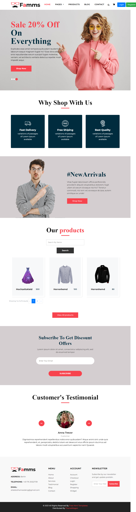
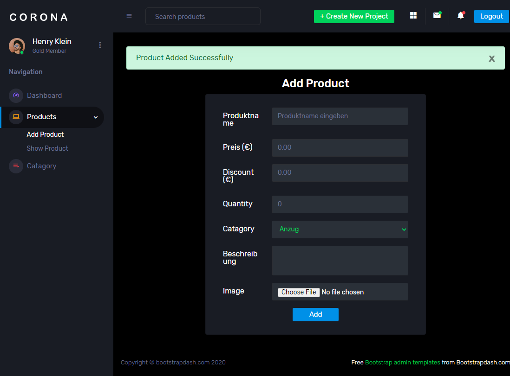
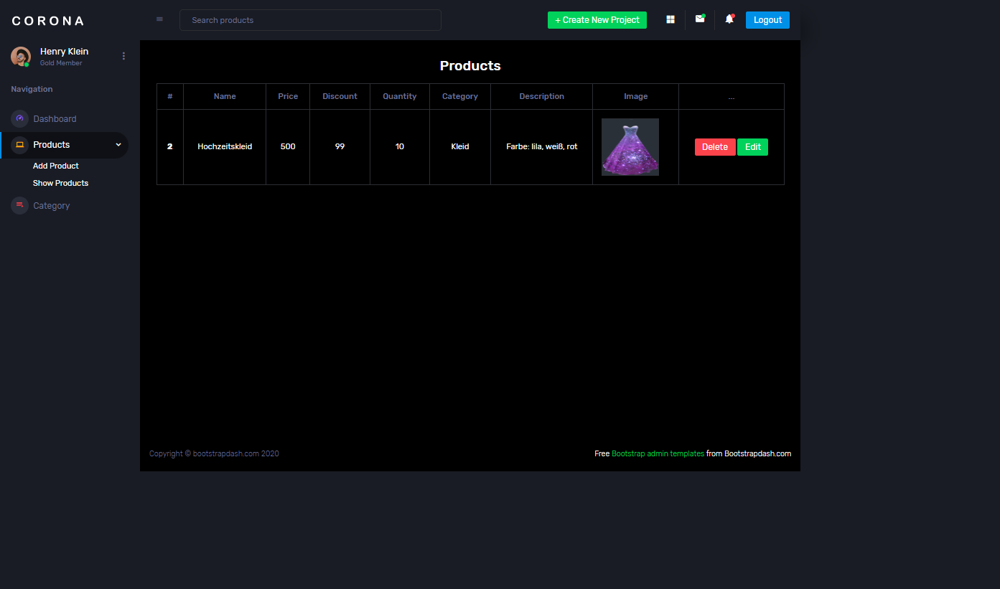
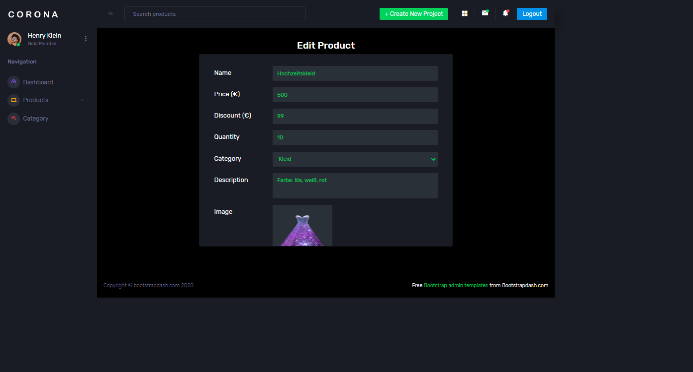

#  Laravel 11 E-Commerce System (Web + API)

##  Projektübersicht

Dieses Projekt ist eine vollständige E-Commerce Webanwendung, entwickelt mit Laravel 11.
Es kombiniert eine klassische Webanwendung (Frontend + Admin Panel) mit einer modernen REST API.

Das Projekt dient als Portfolio-Projekt zur Demonstration von Backend-Entwicklung, API-Design und sauberer Software-Architektur.

---

##  Screenshots

###  Startseite



###  Admin Dashboard


###  Produkt hinzufügen



###  Produktliste



###  Produkt bearbeiten



---

##  Features

###  Authentication (API)

* Benutzerregistrierung & Login
* Token-basierte Authentifizierung mit Laravel Sanctum
* Geschützte API-Endpunkte (`auth:sanctum`)
* Login / Logout mit Access Token

###  Produktverwaltung

* CRUD (Create, Read, Update, Delete)
* Pagination
* Search-Funktion
* Beziehung zu Kategorien (Eloquent Relationships)
* API Resource Transformation (strukturierte JSON Responses)
* Validierung mit Form Requests (Store & Update getrennt)

###  Kategorienverwaltung

* CRUD Operationen
* Verknüpfung mit Produkten
* API Unterstützung

###  Frontend (Blade)

* Startseite
* Produktübersicht
* Admin Dashboard
* Wiederverwendbare Layouts & Components
* UX Verbesserungen (Alerts, Feedback, etc.)

---

##  API Authentication (Sanctum)

### Login

POST /api/login


---

##  API Beispiele

### Alle Produkte

GET /api/products

### Suche

GET /api/products?search=Herrnhemd

### Pagination

GET /api/products?page=2

---

##  API Endpoints

POST   /api/login
POST   /api/logout
POST   /api/register

GET    /api/products
POST   /api/products
PUT    /api/products/{id}
DELETE /api/products/{id}

GET    /api/categories

---

##  Projektstruktur

```
app/
├── Http/
│   ├── Controllers/
│   │   ├── API/
│   │   │   ├── AuthController.php
│   │   │   ├── ProductController.php
│   │   │   └── CategoryController.php
│   │   │
│   │   └── Web/
│   │       ├── ProductController.php
│   │       ├── CategoryController.php
│   │       └── HomeController.php
│   │
│   ├── Requests/
│   │   ├── StoreProductRequest.php
│   │   ├── UpdateProductRequest.php
│   │   ├── StoreCategoryRequest.php
│   │   └── API/
|   |       ├── StoreProductRequest.php
│   │       ├── UpdateProductRequest.php
│   │       ├── StoreCategoryRequest.php
│   │       └── UpdateCategoryRequest.php
│   │
│   ├── Resources/
│   │   ├── ProductResource.php
│   │   └── CategoryResource.php
│   │
│   └── Middleware/
│
├── Models/
│   ├── Product.php
│   ├── Category.php
│   └── User.php
│
routes/
├── web.php
└── api.php
│
resources/
└── views/
    ├── layouts/
    │   ├── app.blade.php
    │   └── admin.blade.php
    │
    ├── admin/
    │   ├── dashboard.blade.php
    │   ├── products/
    │   ├── categories/
    │   └── partials/
    │       ├── header.blade.php
    │       ├── sidebar.blade.php
    │       └── footer.blade.php
    │
    ├── frontend/
    │   ├── home.blade.php
    │   └── partials/
    │       ├── header.blade.php
    │       ├── slider.blade.php
    │       └── footer.blade.php
    │
    └── components/
        ├── alert.blade.php
        └── auth-buttons.blade.php
│
database/
├── migrations/
└── seeders/
```

---

##  UI & Template

Das Projekt basiert auf einem vorgefertigten E-Commerce Template,
das vollständig in Laravel integriert und angepasst wurde.

Der Fokus lag auf:

* Backend-Logik
* API-Entwicklung
* Integration und Anpassung des Designs

---

##  Technologien

* PHP 8.2
* Laravel 11
* MySQL
* Blade Template Engine
* HTML / CSS / JavaScript
* Bootstrap / Tailwind
* Laravel Sanctum (API Authentication)
* Git & GitHub

---

##  Ziel des Projekts

* Vertiefung von Laravel & Backend-Entwicklung
* Entwicklung einer realistischen E-Commerce Anwendung
* Aufbau einer strukturierten REST API
* Anwendung von Best Practices (Validation, Architecture, Security)
* Erstellung eines Portfolio-Projekts für Arbeitgeber

---

##  Projektstatus

Funktionsfähig & bereit zur Demonstration
Weitere Erweiterungen möglich (Orders, Payment, etc.)

---

##  Autor

Ali Abdulhameed
Backend Developer (Laravel)
2026
